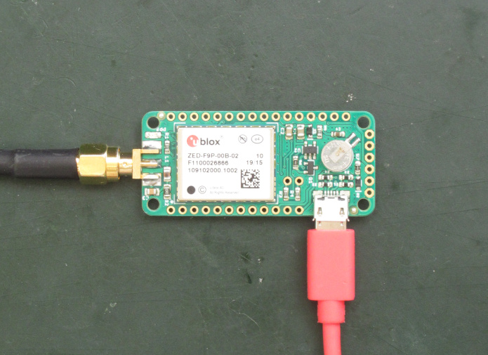
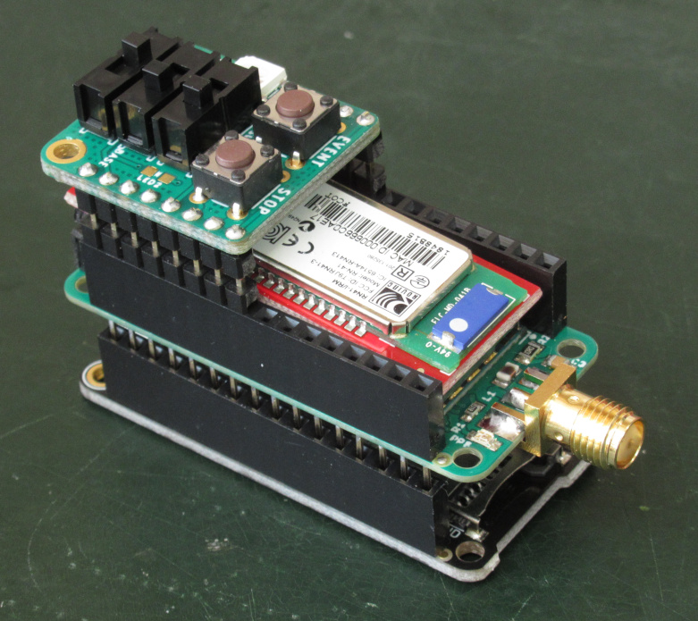
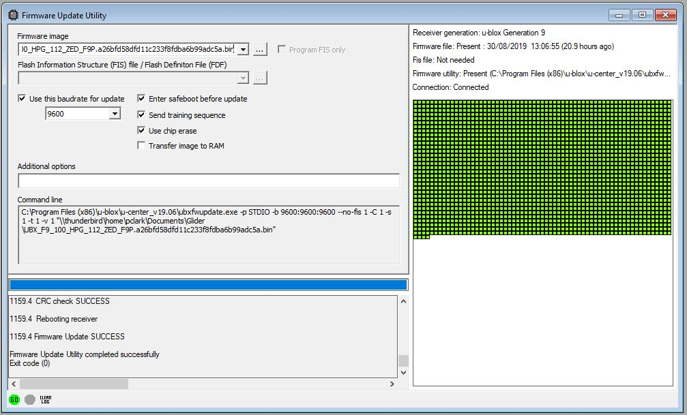

# ZED-F9P FeatherWing USB

A GNSS FeatherWing incorporating the dual-band (L1 + L2) [u-blox ZED-F9P](https://www.u-blox.com/en/product/zed-f9p-module)

The board can be used stand-alone, powered and interfaced through the USB connector:

However, it is designed to mount on top of the [Adafruit Feather M0 Adalogger](https://www.adafruit.com/products/2796)
to form a very compact dual-band PPK data logger or RTK system:

This version provides access to the ZED-F9P's USB port. The [ZED-F9P_FeatherWing](https://github.com/PaulZC/ZED-F9P_FeatherWing) is a simpler version
with fewer components and a CR1220 back-up battery but without USB.

Based extensively on the [Adafruit Ultimate GPS FeatherWing](https://www.adafruit.com/product/3133) and the
[SparkFun GPS-RTK2 Board](https://www.sparkfun.com/products/15136)

If you don't want to make your own FeatherWing and want to use the SparkFun GPS-RTK2 Board instead, you can find a tutorial showing you how to do that
[here](https://github.com/PaulZC/F9P_RAWX_Logger)

See [LEARN.md](./LEARN.md) for more details

[ASSEMBLY.md](./ASSEMBLY.md) contains instructions on how to assemble the PCB

[PAIRING.md](./PAIRING.md) contains instructions on how to configure two SparkFun Bluetooth Mate Gold boards
as a bonded pair, to provide a 115200 Baud RTCM link

The Eagle files are available in the [Eagle folder](./Eagle)

The schematic is available [here](./Schematic.PNG)

The BOM is available [here](./BOM.pdf)

The PCB thickness should be 0.8mm: see the microstrip calculations on the [SparkFun schematic](https://cdn.sparkfun.com/assets/9/a/0/0/a/Qwiic_GPS-RTK2_-_ublox_ZED-F9P.pdf)

## Arduino Code

Two versions of the Arduino code can be found in the [Arduino folder](./Arduino):

- **RAWX_Logger_F9P** is very similar to the logger I wrote for the [NEO-M8T FeatherWing](https://github.com/PaulZC/NEO-M8T_GNSS_FeatherWing) but is substantially updated for the ZED-F9P. It does all of the message configuration via UART1. **PLEASE NOTE:** this example is out-of-date as it uses the old version of the SparkFun u-blox Library.

- **RAWX_Logger_F9P_I2C** uses **version 1.6** of the SparkFun Ublox library to do all of the message configuration via the I2C port instead of UART1. This makes
the code more efficient as it does not need to ignore the UBX ACK messages (on UART1) and can simply stream all data from UART1 to the SD card.

You can find instructions on how to install the Arduino IDE and the required libraries [here](https://github.com/PaulZC/F9P_RAWX_Logger/blob/master/SOFTWARE.md).

The code has three 'modes': Rover, Base and Survey_In. The mode is set via pins A0 and A3 by the [RAWX Logger Switches](https://github.com/PaulZC/RAWX_Logger_Switches). The RAWX
messages are logged to SD card in all three modes for post-processing with [rtklibexplorer's](https://rtklibexplorer.wordpress.com/) version of [RTKLIB](http://rtkexplorer.com/downloads/rtklib-code/).

You will find settings in the code to help with debugging should you need it. Uncomment the line which contains **#define DEBUG** to enable them.

## Updating the ZED-F9P firmware

u-blox released [version 1.12](https://www.u-blox.com/sites/default/files/UBX_F9_100_HPG_112_ZED_F9P.a26bfd58dfd11c233f8fdba6b99adc5a.bin) of the ZED-F9P firmware
on 12th July 2019. If you bought your device(s) before then, it would be beneficial to update. The update process is straight forward and can be done through
the Tools menu in [u-center](https://www.u-blox.com/en/product/u-center) **but the update can only be done through UART1. It will fail if you try to update through USB.**

The [Arduino folder](./Arduino) contains a sketch called ZED-F9P_Echo. This will turn the Adalogger into
a simple USB to UART pass-through which you can use to update the ZED-F9P using u-center. The code runs at **9600 Baud only** so you must tick the
_Use this baudrate for update_ box and select 9600 from the drop-down list. The advice on the u-blox portal seems to be to select the _Use chip erase_ option too.

Updating at 9600 Baud is very slow, but this is the only way to prevent Baud rate changes during the update. The Echo code is very simple and does not support
baud rate changes. If you want to update more quickly, you can use (e.g.) an FTDI TTL-232R-3V3 cable to connect to the UART1 pins instead of the Adalogger.

## Acknowledgements

This project would not have been possible without the open source designs kindly provided by both Adafruit and SparkFun. Their work is gratefully acknowledged.

Adafruit invests time and resources providing this open source design, please support Adafruit and open-source hardware by purchasing products from Adafruit!

Feel like supporting open source hardware? Buy a board from SparkFun!

## Licence

Please see [LICENSE.md](./LICENSE.md) for details.

Enjoy!

**_Paul_**

